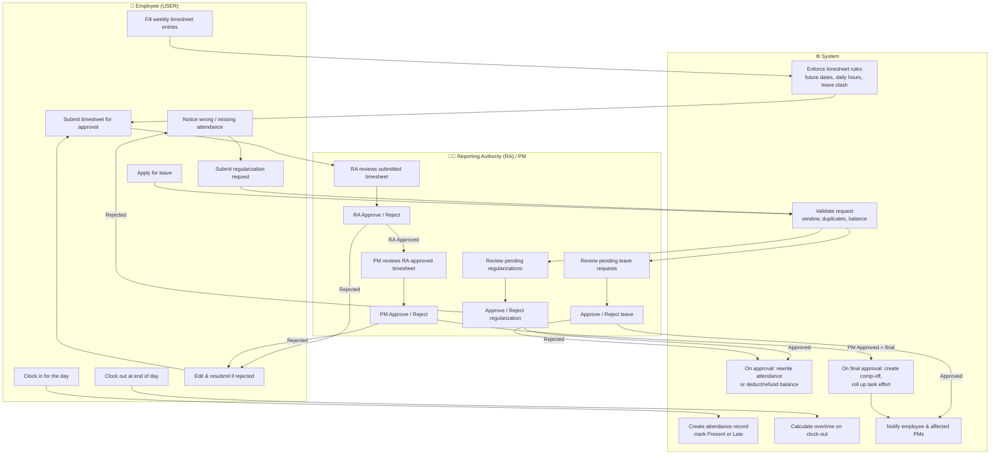
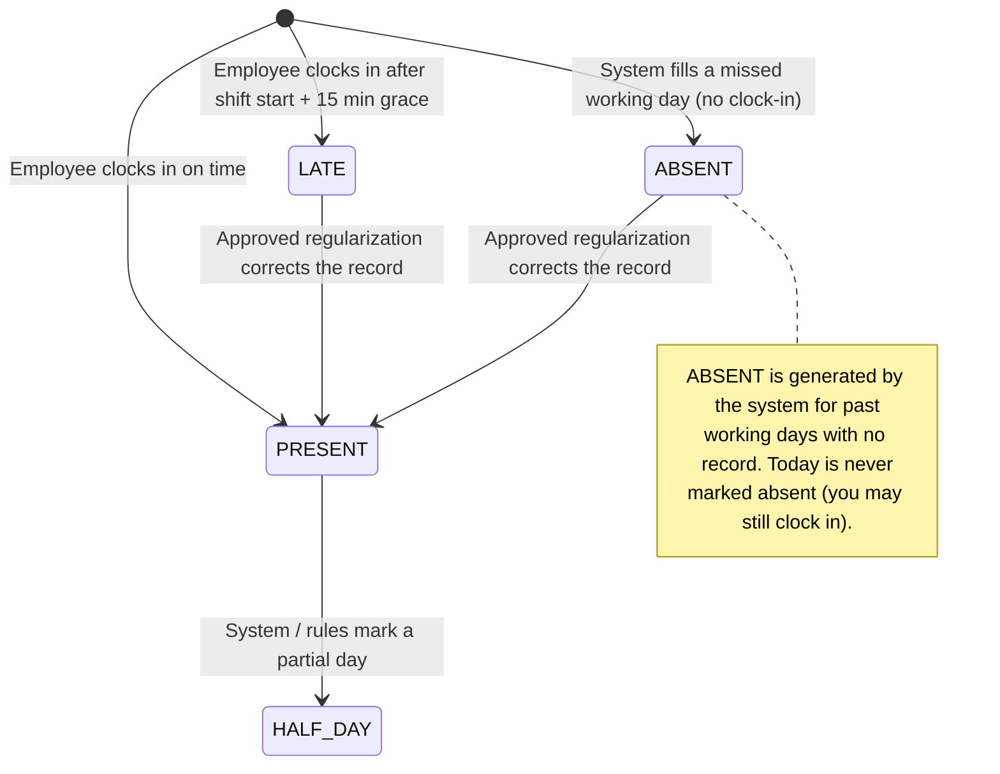
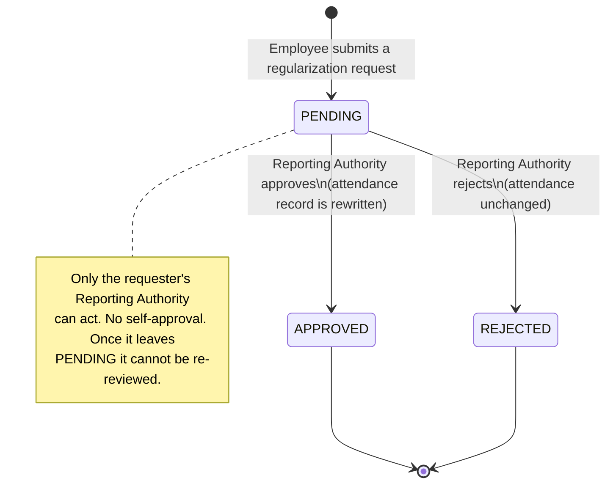
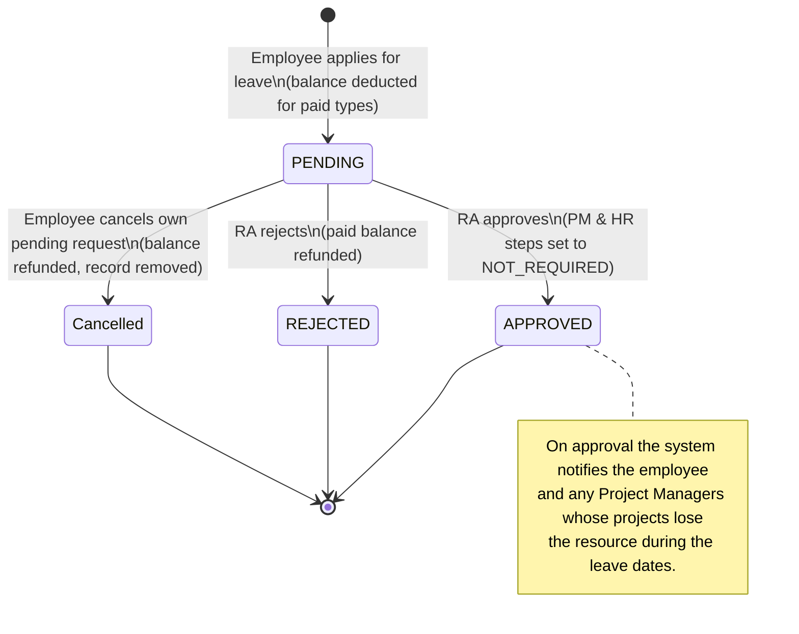
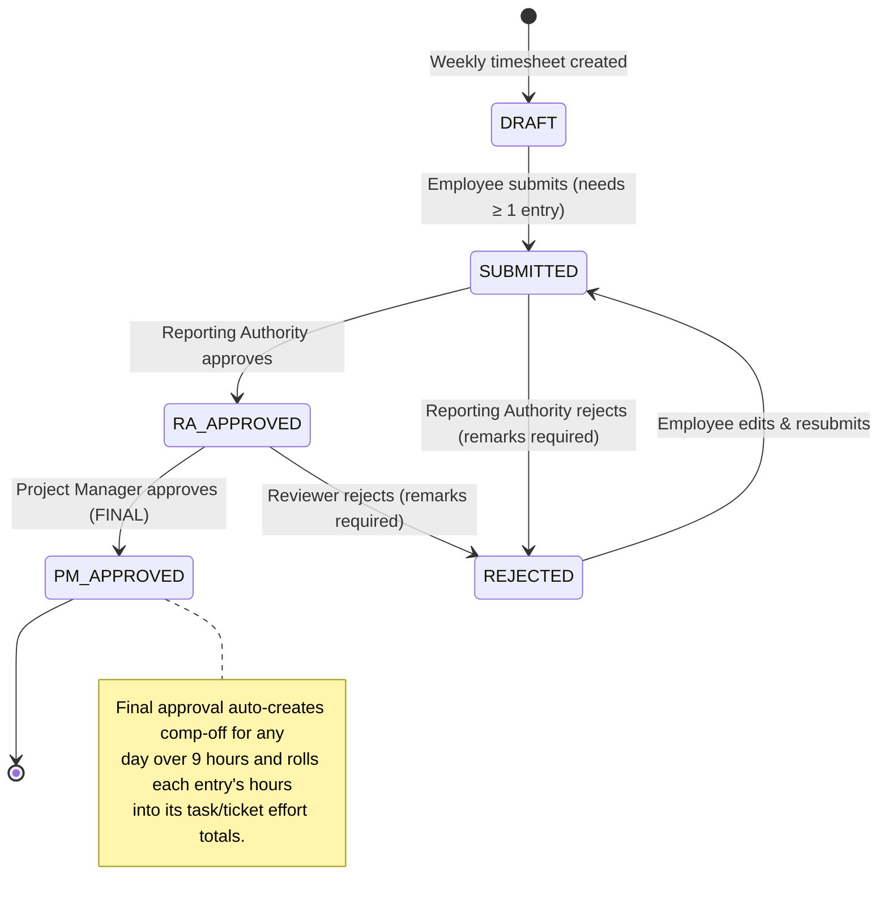
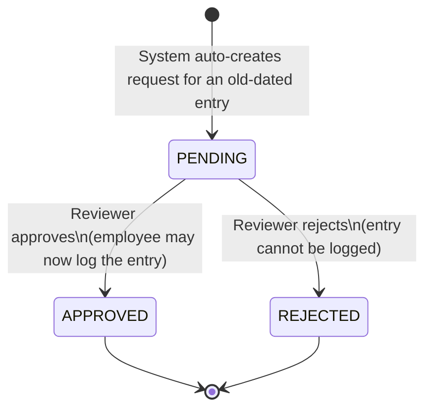

# Newel Planner — Logical Flow Guide

> A plain-language map of how the application works. This document explains the **what** and the **why** of every major flow — not the code. Anyone, technical or not, should be able to read it and understand how attendance, regularization, leave, and timesheets move through the system.
>
> Anything marked **[INFERRED]** is an educated assumption that is not directly confirmed in the code — please verify these before relying on them.

---

## 1. Overview

Newel Planner is an internal workforce-management application for a services company. Employees use it to record their daily attendance (clocking in and out), to request corrections when their attendance was recorded wrongly, to apply for leave, and to fill in weekly timesheets describing the work they did on projects. Managers (called **Reporting Authorities**) use it to review and approve or reject those requests for the people who report to them. The system also keeps running tallies — leave balances, overtime, comp-off (compensatory time off), and effort spent per task — so the company has an accurate, auditable record of who worked, when, and on what.

---

## 2. Roles & Definitions

### Roles

| Role | Plain-English meaning |
|------|------------------------|
| **USER** | A regular employee. Clocks in/out, requests regularizations, applies for leave, and fills timesheets. |
| **TL** (Team Lead) | Leads a team. Acts as a Reporting Authority for their team members and can review their submissions. |
| **PM** (Project Manager) | Owns one or more projects. Reviews timesheets at the second approval stage and is notified when team members go on leave. |
| **HR** (Human Resources) | Manages people-related data such as leave balances; can view attendance and leave across the whole company. |
| **ADMIN** | Full system access. Can configure settings, manage data, and approve almost anything. |
| **FREELANCER** | An external contractor. Submits timesheets against the projects they're assigned to. |

### Key terms

- **Reporting Authority (RA):** The manager a given employee reports to. The RA is the person who approves that employee's requests. Every employee has at most one RA.
- **Clock-in / Clock-out:** Marking the start and end of your working day. Clock-in creates the day's attendance record; clock-out closes it and calculates overtime.
- **Attendance status:** A label the system puts on a day — Present, Late, Half-Day, or Absent.
- **Regularization:** A request to correct an attendance record — for example, "I forgot to punch in" or "the system failed." If approved, it rewrites that day's attendance.
- **Leave:** Time off from work (e.g. casual leave, sick leave). Leave is requested in advance and draws down a **leave balance**.
- **Leave balance:** How many days of each leave type you have available. Paid leave reduces the balance when applied and restores it if the request is rejected or cancelled.
- **Sandwich day:** A non-working day (weekend/holiday) that sits between two leave days or directly adjacent to a leave block, which — for certain leave types — gets counted as leave too.
- **Timesheet:** A weekly record of the hours an employee worked, broken down by day, project, task, and activity.
- **Timesheet entry:** A single line on a timesheet — "X hours on project Y doing activity Z on date D."
- **Backdated entry:** A timesheet entry for a date older than the allowed window, which needs special approval before it can be logged.
- **Comp-off (compensatory off):** Time-off credit earned by working extra-long days, banked as a balance to be used later.
- **Two-tier approval:** Timesheets must be approved twice in sequence — first by the Reporting Authority (RA), then by the Project Manager (PM).
- **Overtime:** Hours worked beyond the scheduled shift length on a given day.

---

## 3. Master Flow (Swimlane)

This diagram shows the main flows across three lanes: the **Employee (USER)**, the **Reporting Authority / Manager (RA)**, and the **System**. It highlights where work hands off from one party to another.

---

## 4. Object Lifecycles (State Diagrams)

Each object below moves through a defined set of statuses. The labels on each arrow show **what triggers** the change and **who** triggers it. All status names are the real ones used by the system.

### 4.1 Attendance

The system sets attendance status automatically; there is no approval step. Status can later change only because an approved regularization rewrites it.

### 4.2 Attendance Regularization Request

### 4.3 Leave Request

The overall request status is **PENDING → APPROVED / REJECTED**. Behind it sit three independent sub-statuses — RA, PM, and HR — each of which can be PENDING, APPROVED, REJECTED, or NOT_REQUIRED. Today only the **RA** step is active; approving at RA marks the PM and HR steps as NOT_REQUIRED and finalises the leave.

> **[INFERRED]** The data model also defines `RECALLED` and `RESUBMITTED` as possible leave states, and a multi-step PM/HR approval chain, but only the single RA-approval path is currently wired up. The fuller chain appears to be planned for the future.

### 4.4 Timesheet

> **[INFERRED]** The frontend lists a `TL_APPROVED` status, but the backend only uses `RA_APPROVED` and `PM_APPROVED`. A Team Lead acts as the Reporting Authority, so a TL approval is effectively the RA approval.

### 4.5 Backdated Timesheet Entry Request

This is a small sub-flow: when an employee tries to log a timesheet entry for a date older than the allowed window, the system creates a request that must be approved before that old entry can be saved.

---

## 5. Detailed Use Cases

### 5.1 Clock-in (and Clock-out)

- **Actor:** Employee (USER)
- **Precondition:** The employee is logged in and has not already clocked in today.
- **Trigger:** Employee taps "Clock in" at the start of the working day.

**Main Flow (Clock-in):**
1. Employee clocks in.
2. The system records the check-in time.
3. The system compares the check-in time against the employee's shift start time plus a 15-minute grace period.
4. If on time, the day is marked **Present**; if later than the grace period, it is marked **Late**.
5. The day's attendance record is created.

**Main Flow (Clock-out):**
1. At the end of the day, the employee clocks out.
2. The system records the check-out time.
3. The system calculates hours worked, subtracts the scheduled shift length (and break time), and stores any positive remainder as **overtime**.

**Alternative Flows:**
- *Already clocked in:* If a clock-in already exists for today, the system refuses a second one ("Already checked in for today").
- *Clock-out without clock-in:* The system refuses clock-out if there's no matching check-in for the day.
- *Already clocked out:* A second clock-out for the same day is refused.
- *No shift defined:* **[INFERRED]** If no shift is configured, lateness falls back to a fixed cutoff of 10:00 AM.
- *Forgot to clock in/out:* The day may end up Absent or incomplete; the employee can fix it later via a regularization request (see 5.2).

**Postcondition:** A dated attendance record exists with a status and, after clock-out, an overtime figure.

---

### 5.2 Submit Regularization

- **Actor:** Employee (USER)
- **Precondition:** The employee's attendance for a past date is missing or wrong (e.g. forgot to punch, system error, was on field work).
- **Trigger:** Employee opens the regularization form and submits a correction request for a specific date.

**Main Flow:**
1. Employee selects the date and a reason (Forgot Punch, System Error, Field Work, Client Visit, Training, or Other), and optionally the corrected in/out times and remarks.
2. The system checks the date is not in the future.
3. The system checks the date falls within the allowed look-back window (default **7 days**).
4. The system checks there isn't already a request for that date.
5. The request is saved as **Pending** and routed to the employee's Reporting Authority.

**Alternative Flows:**
- *Future date:* Rejected — "Cannot regularize a future date."
- *Too old:* Rejected — outside the look-back window ("allowed only within last N days").
- *Duplicate:* Rejected — a request already exists for that date.
- *Outcome notification:* The employee later sees the request as Approved or Rejected (see 5.3).

**Postcondition:** A Pending regularization request exists, visible to the employee and their RA.

---

### 5.3 RA Reviews Regularization

- **Actor:** Reporting Authority (the requester's manager)
- **Precondition:** A pending regularization exists from one of the RA's direct reports.
- **Trigger:** The RA opens the list of pending requests and chooses to approve or reject one.

**Main Flow (Approve):**
1. The RA reviews the request details.
2. The RA approves it.
3. The system marks the request **Approved**, records who approved it and when.
4. If the request is linked to an attendance record, the system rewrites that record's check-in/check-out times with the requested values and recalculates overtime.

**Alternative Flows:**
- *Reject:* The RA rejects the request; it becomes **Rejected** and the underlying attendance is left unchanged.
- *Not your report:* Only the requester's own Reporting Authority may act; anyone else is refused.
- *Self-approval blocked:* An RA cannot approve their own request.
- *Already decided:* If the request is no longer Pending, it cannot be reviewed again ("Request is no longer pending").

**Postcondition:** The request is Approved or Rejected; on approval the attendance record reflects the corrected times.

---

### 5.4 Apply for Leave

- **Actor:** Employee (USER)
- **Precondition:** The employee is logged in and (for paid leave) has enough balance.
- **Trigger:** Employee fills the leave form with start date, end date, leave type, and reason.

**Main Flow:**
1. Employee chooses leave type, dates (or a half-day with a morning/afternoon session), and a reason.
2. The system checks the start date is not after the end date.
3. The system checks the dates don't overlap an existing leave request.
4. The system calculates the duration in working days, adding any **sandwich days** if the leave type requires it.
5. For paid leave types, the system checks the employee has enough balance and deducts the requested days.
6. The request is saved as **Pending** and routed to the employee's Reporting Authority.

**Alternative Flows:**
- *Bad dates:* Start after end → rejected.
- *Overlap:* An existing leave covers the same period → rejected.
- *Insufficient balance:* Paid leave exceeds available balance → rejected with the shortfall shown.
- *Half-day not allowed:* If the leave type doesn't permit half-days, a half-day request is refused.
- *Cancel:* While still Pending, the employee can cancel the request; the record is removed and any deducted paid balance is refunded.

**Postcondition:** A Pending leave request exists; paid balance has been provisionally deducted.

---

### 5.5 RA Reviews Leave

- **Actor:** Reporting Authority (or ADMIN)
- **Precondition:** A pending leave request exists from a direct report.
- **Trigger:** The RA opens pending approvals and acts on a request.

**Main Flow (Approve):**
1. The RA reviews the leave request.
2. The RA approves it.
3. The system marks the request **Approved** (and marks the PM and HR steps as Not Required).
4. The system notifies the employee that their leave is approved.
5. The system notifies any Project Managers whose projects will lose this person during the leave dates.

**Alternative Flows:**
- *Reject:* The request becomes **Rejected**, and any paid leave balance that was deducted is refunded.
- *Not your report:* Only the requester's RA (or an ADMIN) may approve; others are refused.
- *Self-approval blocked:* An employee cannot approve their own leave.
- *Already reviewed:* If the RA step is already decided, it can't be acted on again.

**Postcondition:** The leave is Approved (balance stays deducted) or Rejected (balance refunded); relevant people are notified.

---

### 5.6 Fill & Submit Timesheet

- **Actor:** Employee (USER) — or Freelancer for their assigned projects
- **Precondition:** A weekly timesheet exists (created on demand for the chosen week) and is in **Draft** or **Rejected** state.
- **Trigger:** Employee opens the week's timesheet and logs entries.

**Main Flow:**
1. Employee creates (or opens) the timesheet for a week.
2. For each piece of work, the employee adds an entry: project, date within the week, task/ticket, activity, hours, and an optional description.
3. The system validates each entry against the rules (see Alternative Flows).
4. Once at least one entry exists, the employee submits the timesheet.
5. The timesheet moves to **Submitted** and is routed to the Reporting Authority.

**Alternative Flows:**
- *Future date:* Entries for dates after today are refused.
- *Locked period:* If Finance has locked that month, no entries can be added.
- *Old date (backdated):* Entries older than the allowed window (default **7 days**) trigger a Backdated Entry Request (see 5.8) and can't be logged until it's approved.
- *On approved leave:* Hours can't be logged for a day the employee is on approved leave.
- *Too many hours:* A day's total can't exceed the daily cap (default **24 hours**).
- *Overlapping times:* If start/end times are given, they can't overlap another entry the same day.
- *Wrong assignment:* A task/ticket must belong to the chosen project and be assigned to the employee (managers/admins may log on others' behalf).
- *Copy previous week:* On an empty timesheet, the employee can copy the prior week's entries; holidays and approved-leave days are filtered out automatically.
- *Submit with no entries:* Refused — at least one entry is required.

**Postcondition:** The timesheet is Submitted and awaits RA review.

---

### 5.7 RA & PM Review Timesheet (Two-Tier Approval)

- **Actor:** Reporting Authority (first tier), then Project Manager (second tier)
- **Precondition:** A Submitted timesheet exists from someone in the reviewer's scope.
- **Trigger:** The reviewer opens the submitted timesheet and acts on it.

**Main Flow:**
1. The RA reviews the Submitted timesheet.
2. The RA approves it → status becomes **RA Approved**.
3. The PM reviews the RA-approved timesheet.
4. The PM approves it → status becomes **PM Approved** (final).
5. On final approval, the system:
   - Creates **comp-off** credit for any day worked beyond 9 hours.
   - Adds each entry's hours to the running effort total of its task and ticket.

**Alternative Flows:**
- *RA rejects:* Status becomes **Rejected** with mandatory remarks; the timesheet returns to the employee, who can edit and resubmit.
- *PM rejects:* Same as above — back to the employee as editable.
- *PM tries to skip RA:* The PM step is refused unless the timesheet is already RA Approved (the two tiers can't be skipped).
- *Reject without remarks:* Refused — a rejection reason is required.
- *Out of scope:* A reviewer can only act on timesheets belonging to people within their data scope (e.g. their direct reports).

**Postcondition:** The timesheet is PM Approved (final, with comp-off and effort updated) or Rejected (editable again).

---

### 5.8 Backdated Entry Request (Alternative sub-flow)

- **Actor:** Employee submits; Reviewer (RA/manager) decides.
- **Precondition:** The employee tried to log a timesheet entry older than the allowed window.
- **Trigger:** Adding the old-dated entry.

**Main Flow:**
1. The system blocks the direct entry and creates a **Pending** backdated request explaining the date and reason.
2. The reviewer approves it.
3. The employee can now log the original entry (the daily-hours cap still applies); the employee is notified.

**Alternative Flow:**
- *Reject:* The request becomes **Rejected** and the entry cannot be logged; the employee is notified.

**Postcondition:** The old-dated entry is either permitted (after approval) or blocked.

---

## 6. Business Rules

A plain list of the rules the system enforces. Items tagged **[INFERRED]** are not directly confirmed in code.

### Attendance
- An employee can clock in only once per day, and clock out only once per day.
- Clock-out requires a prior clock-in the same day.
- A day is marked **Late** if clock-in is later than the shift start time plus a **15-minute** grace period.
- **[INFERRED]** If no shift is defined, lateness defaults to a 10:00 AM cutoff.
- Overtime = hours worked − scheduled shift length (minus break time), and is never negative.
- The system automatically marks past working days with no record as **Absent**, but never marks today as absent (the employee may still clock in). Weekends and public holidays are excluded.

### Regularization
- A regularization cannot be for a future date.
- A regularization is allowed only within the last **N days** (default **7**, configurable).
- Only one regularization request is allowed per date.
- Only the requester's Reporting Authority can approve or reject it; no one can approve their own request.
- A request can only be acted on while it is Pending.
- Approving a regularization rewrites the linked attendance record's times and recalculates overtime; rejecting leaves attendance unchanged.

### Leave
- The start date cannot be after the end date.
- A new leave request cannot overlap an existing (non-rejected) one.
- Half-day leave is only allowed for leave types that permit it, and requires a morning/afternoon session.
- For paid leave types, the employee must have enough balance; the requested days are deducted on application.
- **Sandwich days** (weekends/holidays adjacent to or between leave days) are added to the leave count for leave types that require it.
- Rejecting or cancelling a leave refunds the deducted paid balance.
- Only the requester's Reporting Authority (or an ADMIN) can approve leave; self-approval is not allowed.
- Approving leave notifies the employee and the Project Managers of any projects the person is allocated to during the leave.
- **[INFERRED]** PM and HR approval steps and the Recalled/Resubmitted states exist in the data model but are not yet active — only RA approval is currently used. Leave balances also support scheduled expiry and year-end carry-forward (capped per leave type).

### Timesheet
- Timesheet entries can be added or deleted only while the timesheet is **Draft** or **Rejected**.
- Entries cannot be dated in the future.
- Entries cannot be added for a month that Finance has locked.
- Entries older than the backdated window (default **7 days**) require an approved Backdated Entry Request first.
- Hours cannot be logged for a day on which the employee is on approved leave.
- A single day's total hours cannot exceed the daily cap (default **24 hours**).
- If start/end times are provided, entries on the same day cannot overlap.
- A task or ticket logged against must belong to the chosen project and be assigned to the employee — except managers/admins, who may log on others' behalf.
- A timesheet can be submitted only with at least one entry.
- Approval is **two-tier**: the Reporting Authority approves first (RA Approved), then the Project Manager approves (PM Approved). The PM step cannot proceed until the RA step is done.
- A rejection requires non-empty remarks (up to 1,000 characters); a rejected timesheet returns to the employee as editable and can be resubmitted.
- On final (PM) approval, the system creates **comp-off** for any day worked beyond **9 hours** and adds the logged hours to each related task's and ticket's effort totals.
- Reviewers can only act on timesheets belonging to people within their data scope (e.g. their direct reports).

### Roles & Approval Authority
- Approval authority flows through the **Reporting Authority** relationship: each employee has a manager who reviews their requests.
- ADMIN and HR can view data across the whole company; other roles are generally limited to themselves and their direct reports.
- **[INFERRED]** Default permission seeding grants timesheet approval to ADMIN (company-wide), PM, and TL (team scope); a Team Lead's approval functions as the RA approval.

---

*This document describes the system's intended business behaviour as implemented at the time of writing. Where rules depend on configurable settings (look-back windows, daily-hour caps, backdated limits), the stated numbers are the current defaults and may be changed by an administrator.*
